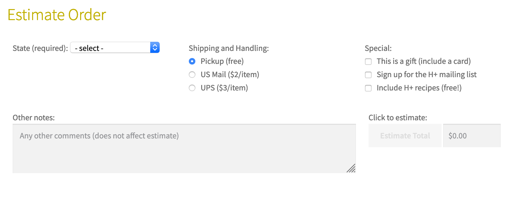
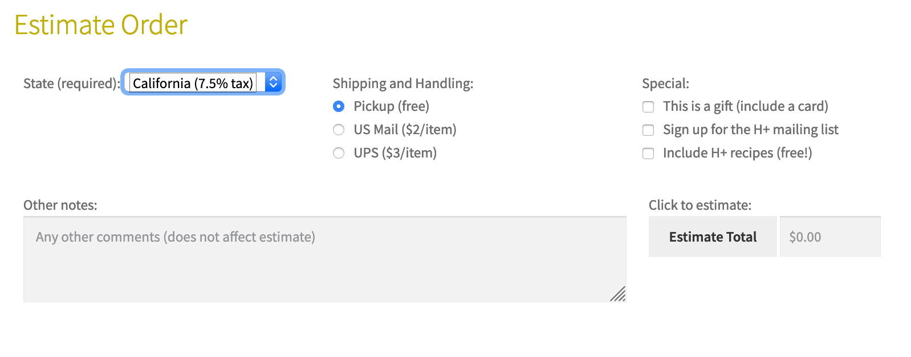

# hplussport

In this project, I used JavaScript to work with the DOM to manipulate form fields, read data,
checking input for errors, and displaying the results of shipping calculations.

# Submit button will be disabled if the state selection is has no value

