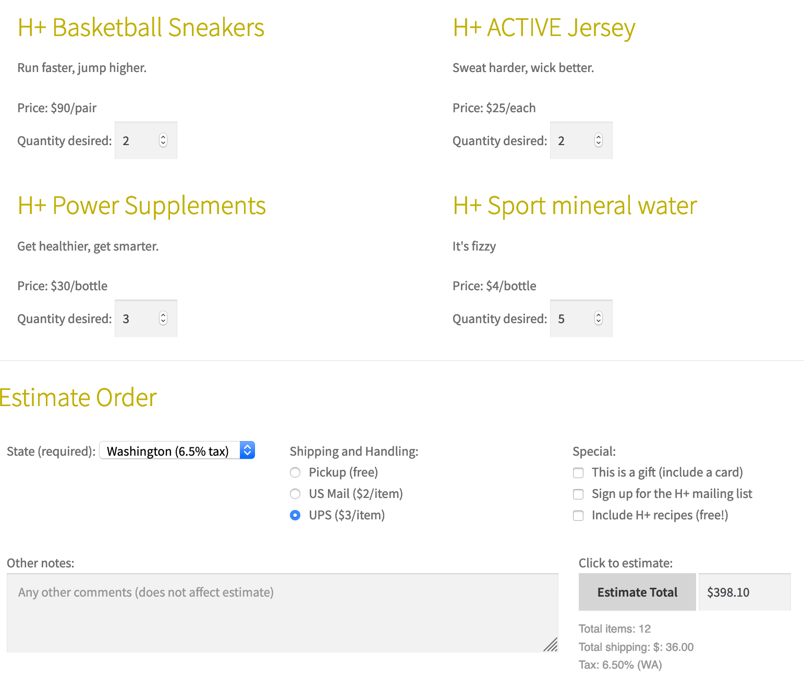

# hplussport

In this project, I used JavaScript to work with the DOM to manipulate form fields, read data,
checking input for errors, and displaying the results of shipping calculations.

# Features
Submit button will be disabled if the state selection is has no value

Estimate Total of total quantity of items, state tax, and shipping methods

